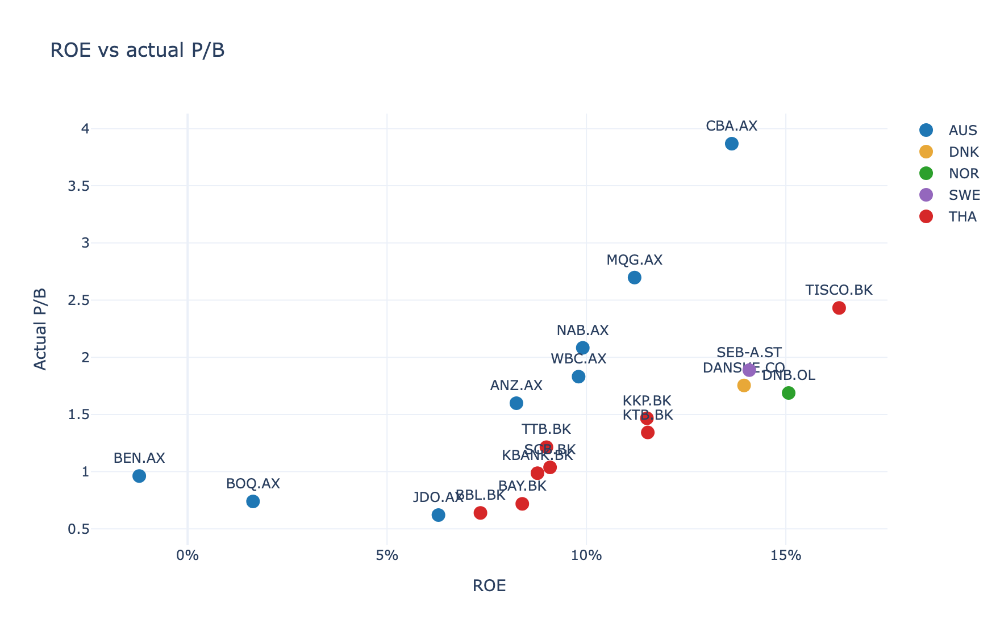
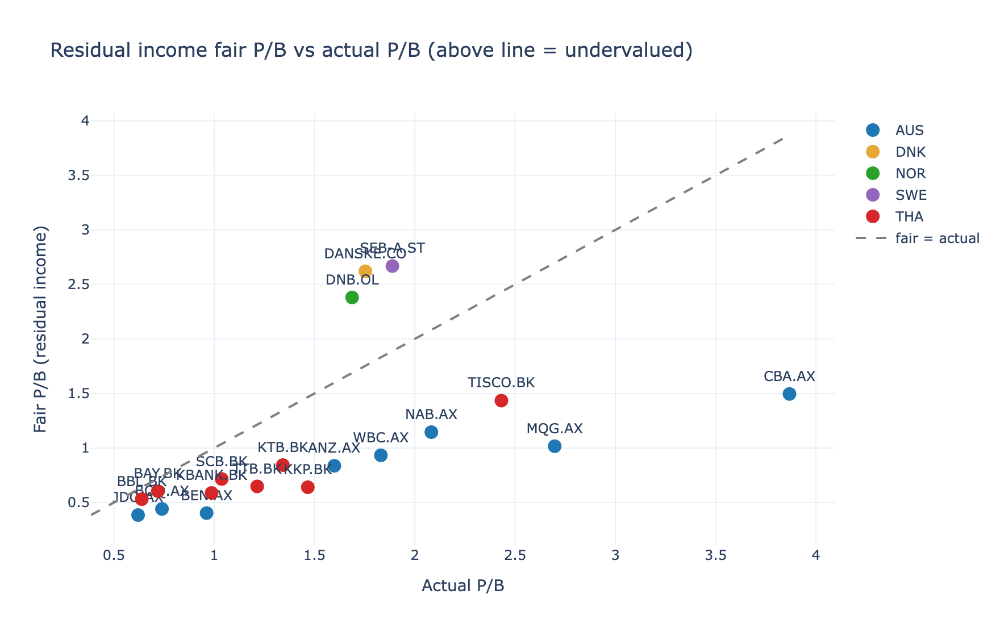
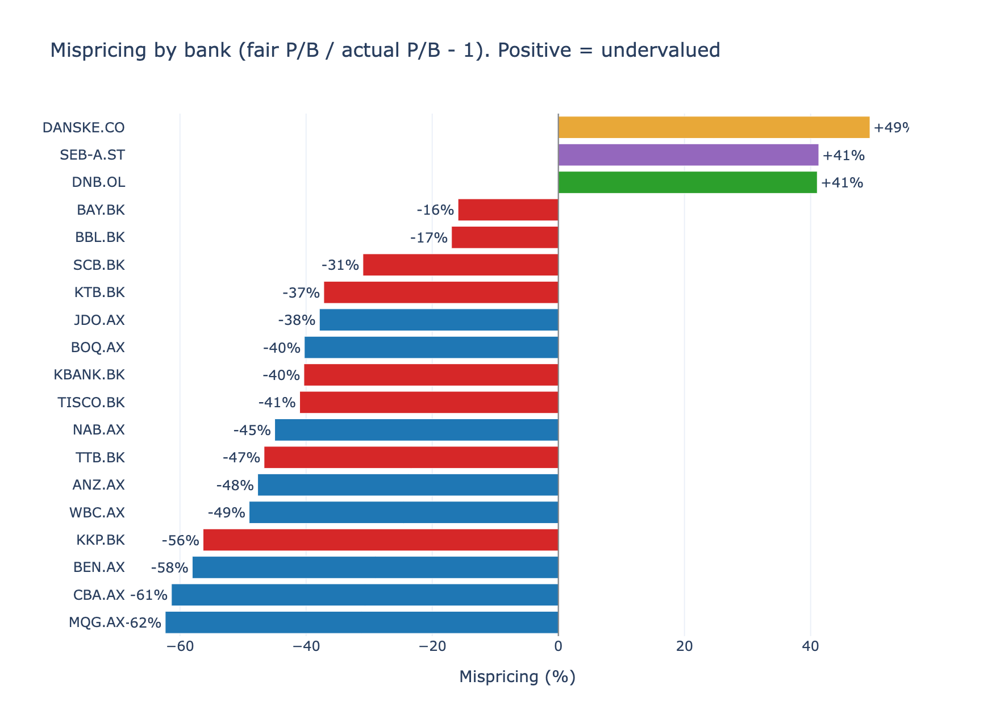
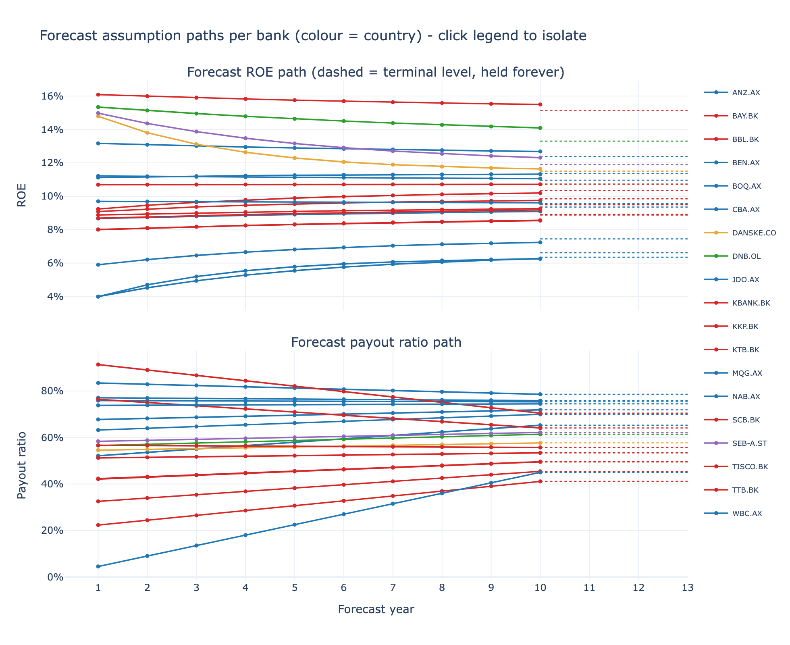

# Bank Equity Valuation with Residual Income

A transparent Python research pipeline for valuing 19 listed banks across
Australia, Thailand, Norway, Sweden, and Denmark. The project converts
bank-specific forecasts for return on equity (ROE), payout, and cost of equity
into an implied fair price-to-book ratio (P/B), then compares fair P/B with the
market P/B to rank possible under- and overvaluation.

The main workflow is configuration-driven, writes auditable intermediate CSVs,
and produces standalone interactive Plotly charts. It is a research tool—not
investment advice or a production trading system.

## What the repository does

| Stage | Purpose | Main file |
|---|---|---|
| 1. Define | Set the bank universe and model assumptions | `config/*.yaml` |
| 2. Fetch | Cache current Yahoo Finance snapshots and annual fundamentals | `src/fetch.py` |
| 3. Build | Turn raw cache files and configuration into reviewable model inputs | `src/build_inputs.py` |
| 4. Value | Run the residual-income model for every bank | `src/run_valuation.py` |
| 5. Compare | Rank mispricing and run country, scenario, and sensitivity analyses | `src/relative_value.py`, `src/scenarios.py`, `src/sensitivity.py` |
| 6. Review | Inspect generated CSV tables and interactive HTML charts | `data/processed/`, `outputs/` |

The active universe is defined only in
[`config/universe.yaml`](config/universe.yaml):

| Market | Country code | Banks | Yahoo suffix |
|---|---:|---:|---|
| Australia | `AUS` | 8 | `.AX` |
| Thailand | `THA` | 8 | `.BK` |
| Norway | `NOR` | 1 | `.OL` |
| Sweden | `SWE` | 1 | `.ST` |
| Denmark | `DNK` | 1 | `.CO` |
| **Total** |  | **19** |  |

## Project history and reports

How the project actually evolved, with the write-ups produced at each step:

| Stage | Status | Summary | Write-up |
|---|---|---|---|
| 1 — Screen and visualize | Done, 6 Jul 2026 | Single-stage Gordon Growth fair-P/B screen plus two exploratory backtests of whether the valuation gap predicted forward returns. Result: weak and ambiguous signal on small samples. | [`logs/session_summary_2026-07-06.pdf`](logs/session_summary_2026-07-06.pdf) |
| 2 — Residual income model | Done, 11 Jul 2026 | Residual income valuation with per-bank CAPM cost of equity. Mid-stage the linear ROE fade was found to punish improving banks, so the forecast engine was rebuilt trajectory-aware over a 10-year horizon. Nordic banks added. | [`logs/mid_project_report_2026-07-09.pdf`](logs/mid_project_report_2026-07-09.pdf), [`logs/final_stage2_report_2026-07-11.pdf`](logs/final_stage2_report_2026-07-11.pdf) |
| 2.5 — Flat-CoE backtests | Done, 30 Jul 2026 | Point-in-time quarterly backtests of the mispricing signal at a flat 10% cost of equity: one regional (Australia and Thailand as separate single-currency books) and one global (all five markets pooled, USD, vs an equal-weight bank benchmark and the S&P 500). 90-day publication lag; full position and trade logs. | [`logs/backtest_flat_coe_2026-07-30.md`](logs/backtest_flat_coe_2026-07-30.md), [`logs/backtest_global_2026-07-30.md`](logs/backtest_global_2026-07-30.md) |
| 3 — Monte Carlo layer | Not started | ROE and payout as distributions, rate-cycle sensitive. The deterministic precursors (scenarios, sensitivity grids) exist. | — |
| 4 — Rigorous historical backtest | Framework only | Lookahead-safe loop and metrics exist; a longer point-in-time fundamentals feed is the missing input (the data source caps history at ~4 annual reports). | — |

## Why residual income

Deposits and wholesale funding are operating inputs for a bank, so conventional
enterprise-value and free-cash-flow-to-firm approaches do not fit as cleanly as
they do for non-financial companies. This model values equity directly:

```text
EPS_t             = ROE_t × BVPS_(t-1)
Dividends_t       = EPS_t × payout_t
BVPS_t            = BVPS_(t-1) + EPS_t - Dividends_t
Residual income_t = (ROE_t - CoE_t) × BVPS_(t-1)
```

For an explicit horizon of `H` years:

```text
Intrinsic value = BVPS_0 + Σ PV(residual income_t) + PV(terminal value)
Fair P/B        = intrinsic value / BVPS_0
Mispricing      = fair P/B / actual P/B - 1
```

A positive mispricing estimate means modelled fair P/B is above market P/B;
a negative estimate means it is below market P/B. A bank earning exactly its
cost of equity has no residual income and is worth book value under the model.

Terminal value is a growing perpetuity of residual income:

```text
Terminal residual income = (terminal ROE - terminal CoE) × BVPS_H
Terminal value           = terminal residual income / (terminal CoE - g)
```

The implementation rejects terminal assumptions where `terminal CoE <= g`,
because the perpetuity would not be economically or mathematically valid.

## Forecast and cost-of-equity logic

The current explicit forecast horizon is 10 years and is controlled by
`forecast.horizon_years` in
[`config/assumptions.yaml`](config/assumptions.yaml).

ROE forecasts are generated in five steps:

1. Average the latest available annual observations and current snapshot.
2. Apply a capped first-year tilt from the recent ROE trend.
3. Mean-revert abnormal ROE toward a terminal level using a persistence factor.
4. Clip each forecast year to the configured realistic ROE range.
5. Estimate terminal ROE as cost of equity plus a capped fraction of the
   bank's demonstrated excess return.

Cost of equity uses CAPM plus an explicit country risk premium:

```text
CoE = risk-free rate + beta × equity risk premium + country risk premium
```

The generated `data/processed/forecast_diagnostics.csv` records the normalized
ROE, trend, persistence, terminal ROE, and payout choices for each bank.

## Current results (30 July 2026, CAPM mode)

The market pays higher P/B for higher ROE; the model asks whether each premium
is the right size:









| Rank | Bank | Fair P/B | Actual P/B | Mispricing |
|---|---|---|---|---|
| 1 | DANSKE.CO | 2.62 | 1.75 | +49% |
| 2 | SEB-A.ST | 2.67 | 1.89 | +41% |
| 3 | DNB.OL | 2.38 | 1.69 | +41% |
| 4 | BAY.BK | 0.60 | 0.72 | −16% |
| 5 | BBL.BK | 0.53 | 0.64 | −17% |
| 6 | SCB.BK | 0.72 | 1.04 | −31% |
| 7 | KTB.BK | 0.84 | 1.34 | −37% |
| 8 | JDO.AX | 0.39 | 0.62 | −38% |
| 9 | BOQ.AX | 0.44 | 0.74 | −40% |
| 10 | KBANK.BK | 0.59 | 0.99 | −40% |
| 11 | TISCO.BK | 1.43 | 2.43 | −41% |
| 12 | NAB.AX | 1.15 | 2.08 | −45% |
| 13 | TTB.BK | 0.65 | 1.21 | −47% |
| 14 | ANZ.AX | 0.84 | 1.60 | −48% |
| 15 | WBC.AX | 0.93 | 1.83 | −49% |
| 16 | KKP.BK | 0.64 | 1.47 | −56% |
| 17 | BEN.AX | 0.40 | 0.96 | −58% |
| 18 | CBA.AX | 1.50 | 3.87 | −61% |
| 19 | MQG.AX | 1.02 | 2.70 | −62% |

Two readings established in the Stage 2 final report: the Nordic cheapness is
partly a low-discount-rate effect (at a flat 10% CoE only DNB stayed clearly
cheap), while the expensive verdicts on the Australian majors (CBA, MQG, NAB)
survive both cost-of-capital regimes. Figures above are regenerated into
`docs/img/` alongside the pipeline; numbers come from
`data/processed/valuation_results.csv` of the same run.

## Backtest results (30 July 2026)

Both backtests hold the cost of equity at a flat 10% for every bank at every
date, so the ranking is a pure profitability-versus-price signal with country
risk switched off by construction. Quarterly rebalance, equal-weighted legs,
annual reports enter the information set only 90 days after fiscal year end,
and forecasts at each date come from the same trajectory-aware engine as the
live model restricted to that date's history.

**Global book, USD** ([`src/backtest_global.py`](src/backtest_global.py)) — all
five markets ranked together, long the top third (~6 of 18 banks):

| Leg | CAGR | Vol | Sharpe | Max DD |
|---|---|---|---|---|
| Strategy (global top third) | 28.7% | 20.6% | 1.35 | −6.6% |
| Equal-weight all banks | 23.4% | 15.5% | 1.46 | −6.8% |
| Expensive half | 18.6% | 16.0% | 1.16 | −6.3% |
| S&P 500 | 21.7% | 11.9% | 1.75 | −4.6% |

The strategy earned the highest return and beat the bank benchmark in 67% of
quarters (mean excess +1.29%/quarter), but with enough extra volatility that
its **Sharpe ratio is below both the equal-weight benchmark and the S&P 500** —
so it added return, not risk-adjusted return. The cheap-minus-expensive spread
was +2.13%/quarter (p = 0.35, i.e. not significant on 15 quarters).

**Regional books, local currency** ([`src/backtest_flat_coe.py`](src/backtest_flat_coe.py)):

| Region | Strategy CAGR | Benchmark CAGR | Spread p-value | Quarters ahead |
|---|---|---|---|---|
| Australia | 21.1% (Sharpe 1.45) | 14.8% (Sharpe 1.06) | 0.12 | 67% |
| Thailand | 24.0% (Sharpe 0.94) | 23.7% (Sharpe 1.35) | 0.61 | 38% |

Australia is where the signal actually showed up: buying the unloved majors
against CBA/Macquarie added ~6 points a year at the same volatility, and the
expensive half lagged badly (9.3% CAGR, −19% drawdown). Thailand showed no
edge — the strategy matched a rising benchmark with more volatility, the
classic value-trap pattern, consistent with the Stage 1 finding that the Thai
signal was never statistically there.

**How to read these honestly.** Fifteen quarters is a sanity check, not
validation; nearly every leg made double digits, so much of the return is the
2022–26 bank rally rather than the signal. The global ranking is partly a
country-multiple sort by construction (removing the country risk premium makes
low-P/B markets look cheap), so its long book concentrates in Thailand and the
Nordics — an average of 2.7 of 5 countries represented. And the point-in-time
forecast engine is information-starved early: with only one effective annual
report in 2022–23, the trend tilt is zero and the persistence adjustment
inactive, so the early and late periods are not testing an identical model.

**Position and trade audit trail.** Every backtest writes a full record of what
was owned and when:

| File | Contents |
|---|---|
| `data/processed/backtest_global_positions.csv` | Every bank × every quarter: rank, fair/actual P/B, mispricing, whether held, action, weight, entry and exit price in USD, realised return |
| `data/processed/backtest_global_trades.csv` | Buy/sell blotter — one row per transaction with price, mispricing and rank at the trade, and the reason |
| `data/processed/backtest_*_periods.csv` | Per-quarter returns for every leg |
| `data/processed/backtest_*_daily.csv` | Daily growth-of-1 for every leg |
| `outputs/charts/backtest_global.html`, `backtest_flat_coe.html` | Daily curves; the strategy is drawn bold |

A position is bought when it enters the top third, held while it stays, sold at
the rebalance date it drops out, and marked `STILL HELD` if open when the
backtest ends. Turnover is low — 20 transactions across 15 quarters.

## Judgment calls log

Every non-obvious modelling decision, why it was made, and where to change it:

| # | Decision | Why | Where |
|---|---|---|---|
| 1 | Stage 1 calibrated the Australian cost of capital to ~8% from an r-sweep; the Thai sweep's 15% was rejected as a spurious-correlation artifact | Small samples (p = 0.26, n ≈ 21–25 per country) do not support tuned parameters | legacy `cost_of_capital` block |
| 2 | Forecast engine rebuilt trajectory-aware (v2) | The linear fade treated improving and declining banks identically, and single-year snapshots (a 257% payout, a −1.2% ROE) anchored whole forecasts | `src/forecast.py`, `forecast:` config |
| 3 | Abnormal-ROE persistence 0.80, ±0.10 by track-record stability, bounds [0.60, 0.92] | Empirical accounting literature puts annual persistence near 0.6–0.8; stable bank franchises sit at the top of the range | `forecast.persistence*` |
| 4 | Terminal spread floor widened from −1% to −4% | The tight floor perversely forecast weak banks to rise to CoE − 1% (e.g. KBANK 8.4% → 11.5%) purely because their discount rate was high | `forecast.terminal.spread_floor` |
| 5 | Franchise weight 0.75 with a +5% durable-spread cap | Most of a demonstrated moat endures but competition erodes some; the cap binds only on outliers | `forecast.terminal` |
| 6 | Nordic betas floored at 0.90 | Measured local-index betas of 0.34–0.59 implied 4.5–5.5% costs of equity — implausible for leveraged banks and an index-composition artifact | `capm.beta_overrides` |
| 7 | Thailand carries a +3% country risk premium | Makes FX, political, and liquidity risk explicit, so the model explains rather than observes why Thai banks can trade below book | `capm.country_defaults.THA` |
| 8 | Flat 10% cost-of-equity mode built as a first-class toggle | Neutralizing risk differences shows which verdicts depend on the discount rate: SEB/Danske's cheapness largely does; CBA/MQG's expensiveness does not | `capm.flat_cost_of_equity` |
| 9 | Backtest applies a 90-day publication lag and runs regions as separate single-currency books | Removes the main lookahead risk; avoids FX mixing without a hedging model | `src/backtest_flat_coe.py` |
| 10 | Historical P/B snapshots use dividend-adjusted prices — a known, documented bias | Slightly understates older P/B levels (returns are unaffected); documented rather than silently accepted | Stage 1 backtests, `backtest_flat_coe.py` docstring |
| 11 | The "minimum banks to rank" guard applies to the pooled universe, not to each country | A bug found on 30 Jul 2026: the per-region guard of 4 names silently excluded every single-bank country (Norway, Sweden, Denmark) from the *global* backtest, dropping exactly the names the live model ranks most undervalued. Fixed, and covered by a regression test | `value_region_at_date(min_banks=...)`, `tests/test_backtest_pooling.py` |

## Quick start

Python 3.12 or newer is recommended.

```bash
python -m venv .venv
source .venv/bin/activate
python -m pip install -r requirements.txt
```

A fresh clone contains configuration and selected example outputs, but raw and
processed data are intentionally Git-ignored. Fetch current data, build the
inputs, and run the valuation:

```bash
python src/fetch.py
python src/build_inputs.py
python src/run_valuation.py
```

`run_valuation.py` automatically runs `build_inputs.py` when required processed
inputs are missing. It does not download market data automatically, so a fresh
clone still needs `fetch.py` first.

To run the backtests (they reuse the same cached fundamentals; the global one
additionally downloads daily FX pairs and the S&P 500 on first run):

```bash
python src/backtest_flat_coe.py   # regional books, local currency
python src/backtest_global.py     # pooled global book, USD
```

To replace today's cached Yahoo Finance data before rebuilding:

```bash
python src/fetch.py --refresh
python src/build_inputs.py
python src/run_valuation.py
```

Useful fetch modes:

| Command | Result |
|---|---|
| `python src/fetch.py` | Fetch or reuse today's snapshot and annual history for all configured banks |
| `python src/fetch.py --refresh` | Redownload and overwrite today's cache |
| `python src/fetch.py --snapshot-only` | Update only point-in-time market/fundamental snapshots |
| `python src/fetch.py --history-only` | Update only annual ROE, payout, and BVPS history |

Yahoo Finance access is required only for the fetch step. Building inputs,
running valuations, tests, and chart generation work from local files.

## Configuration

[`config/assumptions.yaml`](config/assumptions.yaml) is the single source of
truth for model settings.

| Section | Controls |
|---|---|
| `capm.flat_cost_of_equity` | Optional common CoE override for comparison runs |
| `capm.country_defaults` | Risk-free rate, ERP, country premium, and fallback beta |
| `capm.beta_overrides` | Per-bank beta assumptions |
| `forecast` | Horizon, history window, trend tilt, persistence, and sanity clips |
| `forecast.terminal` | Durable franchise spread, cap, and floor |
| `forecast.country_anchors` | Fallback terminal ROE, payout, and growth by country |
| `scenarios` | Additive bull/base/bear shifts |
| `sensitivity` | Terminal ROE, CoE, and growth stress grids |
| `cost_of_capital`, `growth` | Inputs for the older single-stage GGM screen only |

All percentage-like model inputs are decimals: `0.10` means 10%.

After changing the universe or assumptions, rebuild the processed inputs before
running the model:

```bash
python src/build_inputs.py
python src/run_valuation.py
```

Generated CSVs are overwritten by `build_inputs.py`. If you want to preserve a
manual analyst case, copy it elsewhere or encode the change in configuration
before rebuilding.

## Outputs

The main pipeline writes:

| Path | Contents |
|---|---|
| `data/processed/bank_panel.csv` | Joined universe, fundamentals, and CoE inputs |
| `data/processed/valuation_assumptions.csv` | Annual forecast and terminal rows by bank |
| `data/processed/forecast_diagnostics.csv` | Audit trail for generated forecast paths |
| `data/processed/valuation_results.csv` | Intrinsic value, fair P/B, actual P/B, and rank |
| `data/processed/valuation_yearly_detail.csv` | Year-by-year book value and residual income |
| `data/processed/relative_value_table.csv` | Mispricing, z-scores, signal, and rank |
| `data/processed/scenario_results.csv` | Base, bull, and bear fair P/B estimates |
| `data/processed/cost_of_equity_by_country.csv` | Average CoE components by country |
| `outputs/tables/sensitivity_terminal_roe_vs_coe.csv` | Per-bank sensitivity grid |
| `outputs/charts/ri_*.html` | Standalone interactive Plotly charts |

Files already committed under `outputs/` and `logs/` are historical research
artifacts. Their dates and assumptions may differ from a newly generated run;
regenerate the pipeline when you need current, internally consistent results.

## Repository layout

```text
config/
  assumptions.yaml              Model, scenario, and sensitivity settings
  universe.yaml                 Configured bank universe
data/
  raw/                          Local Yahoo Finance JSON cache (ignored)
  processed/                    Generated model inputs/results (ignored)
docs/img/                       README figures (regenerated with the pipeline)
logs/                           Historical project reports + backtest logs
outputs/
  charts/                       Interactive HTML research charts
  tables/                       Generated and historical result tables
src/
  fetch.py                      Data-cache command and Yahoo Finance adapter
  build_inputs.py               Raw/config to auditable processed inputs
  forecast.py                   ROE and payout forecast generation
  cost_of_equity.py             CAPM and country-risk calculations
  residual_income_model.py      Core valuation engine
  relative_value.py             Ranking, z-scores, and signals
  scenarios.py                  Bull/base/bear cases
  sensitivity.py                Two-variable valuation stresses
  plots.py                      Residual-income charts
  run_valuation.py              Main end-to-end valuation command
  screen.py, model.py           Legacy single-stage GGM screen
  backtest.py                   Point-in-time RI backtest framework
  backtest_flat_coe.py          Flat-10%-CoE quarterly backtest (regional books)
  backtest_global.py            Flat-10%-CoE global pooled backtest (USD)
  *_backtest.py                 Exploratory legacy backtests
tests/                          Unit tests for core model components
```

The `notebooks/` directory is currently a placeholder; the maintained workflow
uses the scripts above.

## Testing

```bash
python -m pytest tests -q
```

The tests cover cost of equity, forecast construction, residual-income
valuation, relative-value ranking, and a regression test on the backtest's
universe pooling (see judgment call 11).

## Backtesting status

Three layers, from most to least concrete (results are in
[Backtest results](#backtest-results-30-july-2026) above):

- **`src/backtest_global.py`** — all five markets pooled into one USD-measured
  ranking, long the global top third, benchmarked against an equal-weight bank
  basket and the S&P 500. Valuation ratios stay in local currency (P/B is
  currency-free); only realised returns are FX-converted.
- **`src/backtest_flat_coe.py`** — the same engine run as separate regional
  books in local currency. Better controlled than the global version, because a
  within-country ranking cannot smuggle in a country bet.
- **`src/backtest.py`** — the generic lookahead-aware loop and performance
  metrics both scripts build on.

The anti-lookahead contract is enforced in all three: fundamentals enter only at
fiscal year end plus a publication lag, prices are read at or before the
rebalance date, and returns are measured strictly forward. What is missing for a
genuinely conclusive test is *length*: the data source exposes only about four
annual reports per bank, so no amount of care turns 15 quarters into statistical
validation.

## Important limitations

- Yahoo Finance fields can be missing, delayed, restated, or defined
  inconsistently across markets.
- Betas and macro assumptions are editable research estimates, not live feeds.
- Terminal value can be a large part of intrinsic value; use the scenario and
  sensitivity outputs rather than relying on a single point estimate.
- Currency values are modelled per share within each listing. Do not compare
  intrinsic value per share across currencies; compare dimensionless P/B and
  mispricing measures.
- A model signal is not a recommendation. Capital adequacy, asset quality,
  regulation, liquidity, governance, and market-specific risks require separate
  analysis.

## Legacy tools

`src/screen.py` and `src/model.py` retain the original single-stage Gordon
Growth fair-P/B screen for comparison. The residual-income pipeline in
`src/run_valuation.py` is the primary maintained workflow. The exploratory
backtest scripts are research artifacts and are not substitutes for the
point-in-time framework in `src/backtest.py`.
